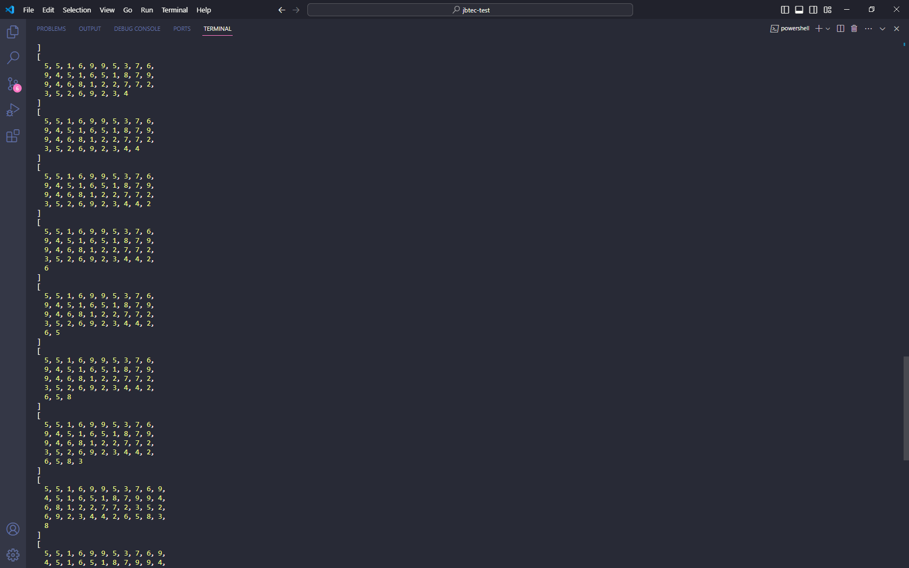

# Sistema de throttle de execucao de funcoes assincronas

### Descrição 

Este projeto consiste em um sistema de throttle para a execução de funções assíncronas, com o objetivo de otimizar o processamento de um array de cargas de trabalho simuladas por meio de delays.

### Configurações do Ambiente

O ambiente de desenvolvimento inclui as seguintes configurações:

- ESLint com o padrão Airbnb para garantir a consistência e boas práticas de codificação.
- Prettier para formatação automática do código, utilizando um tabWidth de 4 espaços.
- Commitlint para garantir que os commits sigam o padrão definido pelo Conventional Commits.
- Husky é utilizado para acionar automaticamente as verificações de linting e commitlint antes de cada commit.

### Como Usar 

Siga as etapas abaixo para configurar e utilizar o ambiente de desenvolvimento:

1. Clone este repositório para o seu ambiente local:

```
 git clone https://github.com/GiovanaPR2202/jbtec-test

```

2. Instale as dependências do projeto:

```
 npm install

```
3. Após a instalação das dependências, você pode compilar o código TypeScript para JavaScript executando o seguinte comando:

```
 tsc index.ts 

```
4. Uma vez compilado o código TypeScript, você pode executar o script principal utilizando o seguinte comando:

```
  node index.ts 

```
5. Antes de confirmar suas alterações, verifique o código usando o seguinte comando:

```
 npm run precommit

```
Isso irá executar as verificações de linting e commitlint para garantir que o código esteja formatado corretamente e que os commits sigam o padrão especificado.


### Saida do terminal 

Após executar o código o resultado deverá se assim :


